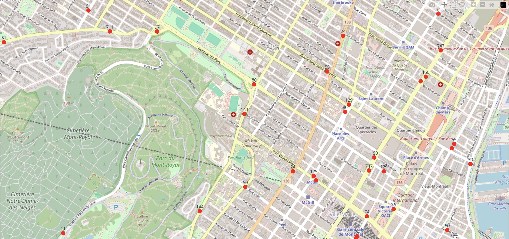

# Build an interactive dashboard

Now let's display the vehicle positions on an interactive map. You'll build a full-screen dashboard that shows bus locations in real time, with each bus labeled by its route number. The map auto-refreshes every 10 seconds and preserves your zoom and pan position.

## The code

Create a file called `app.py`:

```python linenums="1"
import os
import dash
from dash import html, dcc, Input, Output
import plotly.graph_objects as go
import requests
from google.transit import gtfs_realtime_pb2

URL = "https://api.stm.info/pub/od/gtfs-rt/ic/v2/vehiclePositions"
CENTER = {"lat": 45.5236, "lon": -73.5830}


def fetch_vehicles():
    resp = requests.get(
        URL,
        headers={
            "accept": "application/x-protobuf",
            "apiKey": os.environ["STM_API_KEY"],
        },
    )
    feed = gtfs_realtime_pb2.FeedMessage()
    feed.ParseFromString(resp.content)

    lats, lons, labels, hovers = [], [], [], []
    for e in feed.entity:
        if not e.HasField("vehicle"):
            continue
        v = e.vehicle
        if not v.HasField("trip"):
            continue
        label = v.trip.route_id
        lats.append(v.position.latitude)
        lons.append(v.position.longitude)
        labels.append(label)
        hovers.append(f"Route {label} - {v.position.speed * 3.6:.0f} km/h")
    return lats, lons, labels, hovers


app = dash.Dash(__name__)
app.layout = html.Div(
    [
        dcc.Graph(id="map", style={"height": "100vh"}, config={"scrollZoom": True}),
        dcc.Interval(id="refresh", interval=10_000),
    ],
    style={"margin": 0, "padding": 0, "height": "100vh", "overflow": "hidden"},
)


@app.callback(Output("map", "figure"), Input("refresh", "n_intervals"))
def update(_):
    lats, lons, labels, hovers = fetch_vehicles()
    fig = go.Figure(
        go.Scattermap(
            lat=lats,
            lon=lons,
            text=labels,
            hovertext=hovers,
            mode="markers+text",
            textposition="top center",
            marker=dict(size=12, color="red", allowoverlap=True),
        )
    )
    fig.update_layout(
        map=dict(style="open-street-map", center=CENTER, zoom=14),
        margin=dict(r=0, t=0, l=0, b=0),
        paper_bgcolor="white",
        uirevision="keep-view",  # preserve zoom/pan across refreshes
    )
    return fig


if __name__ == "__main__":
    app.run(debug=True)
```

This example code:

- Lines 1-6: Import required modules (`os`, `dash`, `plotly`, `requests`, and `gtfs_realtime_pb2`)
- Lines 8-9: Define API endpoint URL and where the map should be centered
- Lines 12-35: Fetch vehicle positions and parse the Protocol Buffer response. GTFS Realtime reports `position.speed` in meters per second, so the hover text multiplies by 3.6 for km/h.
- Lines 38-45: Create Dash app with full-screen map layout. `dcc.Graph` displays the map, `dcc.Interval` refreshes the data every 10 seconds.
- Lines 48-68: Define callback to update map every 10 seconds with vehicle positions. `Output("map", "figure")` declares that the return value updates the `figure` property of the map component. The `dcc.Interval`'s `n_intervals` is the input that triggers the callback, which calls `fetch_vehicles()` and builds a `Scattermap` figure. `uirevision="keep-view"` preserves zoom and pan across refreshes.
- Lines 71-72: Run the app in debug mode

## Run it

<!-- no-test -->
```sh
python app.py
```

Open [http://localhost:8050](http://localhost:8050) in your browser. You should see a map of Montreal with labeled dots representing buses, each showing its route number.



Congratulations, you've built a realtime bus locations dashboard from scratch! You've learned the basics of GTFS Realtime data, fetched live vehicle positions, parsed Protocol Buffer responses, and displayed them on an interactive map.

The final code is available in the [realtime-bus-dashboard repository on GitHub](https://github.com/LiamConnors/realtime-bus-dashboard).

